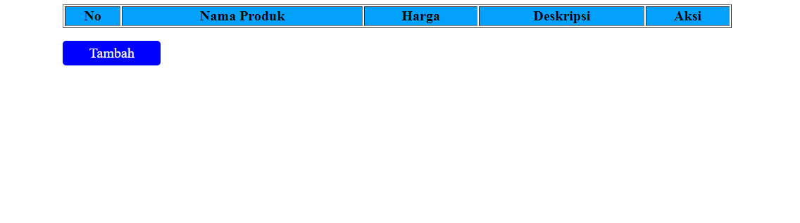

# Aplikasi CRUD Produk

Aplikasi CRUD (Create, Read, Update, Delete) untuk mengelola produk berbasis web yang dibangun menggunakan HTML, CSS, dan PHP.

## Daftar Isi

- [Pendahuluan](#pendahuluan)
- [Fitur](#fitur)
- [Teknologi yang Digunakan](#teknologi-yang-digunakan)
- [Instalasi](#instalasi)

## Pendahuluan

**Aplikasi CRUD Produk** adalah aplikasi berbasis web yang memungkinkan pengguna untuk mengelola data produk. Pengguna dapat menambahkan, melihat, mengedit, dan menghapus produk melalui antarmuka yang sederhana. Aplikasi ini menggunakan PHP untuk logika backend dan HTML/CSS untuk antarmuka pengguna.

## Fitur

- Menambahkan produk baru ke dalam sistem.
- Melihat daftar produk yang telah ditambahkan.
- Mengedit informasi produk yang sudah ada.
- Menghapus produk dari daftar.
- Desain responsif yang mendukung penggunaan di perangkat seluler dan desktop.



## Teknologi yang Digunakan

- **HTML** - Untuk struktur halaman web.
- **CSS** - Untuk styling dan desain antarmuka.
- **PHP** - Untuk logika backend dan pengolahan data produk.
- **SQLite/MySQL** - Untuk menyimpan data produk.

## Instalasi

1. Clone repositori ini ke direktori lokal:
   ```bash
   git clone https://github.com/rffdpryt/CRUD-produk.git
